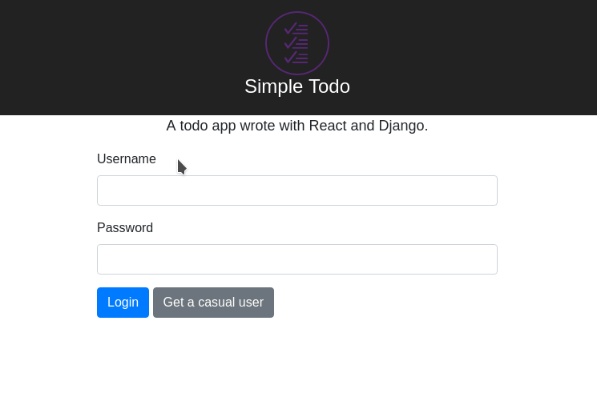
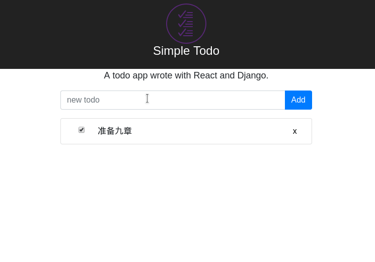

## Features

-   [x] 用户登录
-   [x] 增加一个待办事项
-   [x] 删除一个待办事项
-   [x] 标记一个待办事项为已完成
-   [ ] 编辑一个待办事项的具体内容
-   [x] 列出所有的待办事项
-   [ ] 列表界面支持翻页
-   [ ] 待办事项可以设置优先级
-   [ ] 待办事项可以设置 expire date
-   [ ] 支持按照不同的方式排序，如优先级，expire date

## Features Demonstration

login



add, delete, complete todo, and list all todos



## Tech Stack

-   Bootstrap v4
-   [reactstrap](https://reactstrap.github.io/)
-   Django v1.8
-   Django REST Framework v3.6(to support Django v1.8)
-   Python v2.7
-   PostgreSQL

## Running on local

```sh
# Init db
docker run --name postgres -p 5432:5432 -e POSTGRES_PASSWORD=mysecret -d postgres:13-alpine

# Run backend
cd todo_backend
vim .env
pipenv install
pipenv shell
python manage.py migrate
python manage.py createsuperuser
python manage.py runserver 8624

# Run app
cd ../react_app
npm install
npm start

# Done, open http://localhost:3000/ and login with the user created by
# `python manage.py createsuperuser`.
```

## Models

```js
const todo = {
    id,
    title,
    detail,
    done,
    priority,
    expires,
    createTime,
    updateTime,
};
/*
对于 priority, 有(高, 中, 低, 无) 四种优先级.(参考 Todoist)
*/
```

## RESTful API

### Todo

-   Add: `POST /todos`
-   Delete: `DELETE /todos/:id`
-   Mark as done: `PATCH /todos/:id`
-   Modify: `PUT /todos/:id`
-   List all: `GET /todos`

### User

-   Login: `POST /users/login`
-   Get a casual user: `GET users/casual`

## Todo

-   API version control
-   [Best practices for API versioning? [closed]](https://stackoverflow.com/questions/389169/best-practices-for-api-versioning)
